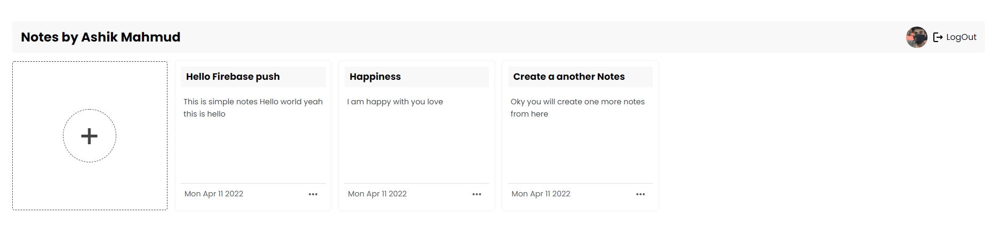

# Notes App using React js and firebase

This is simple and dynamic application using firebase and react. here you will get all the features of CRUD and it's allows you to loggedIn using facebook, google just look up my application live link on about.

## Using Technologies

- React Js Library
- React Router Library for routing
- React Hot Toast for fancy message
- Material UI for Ui Design
- Material Icons for icon
- Styled Components for SASS
- React Skeleton Loading
- Firebase Database for storing data
- Authenticate using Firebase auth
  and many more

## Required Features

- Authenticate of Google, Facebook
- You will create a notes for particular account
- Also can edit delete your notes real time.
-

## Demo Link on About Or [Here](https://notes-app-d645c.web.app/)

## Preview Image here please look up

> Thanks for reach out me on github
